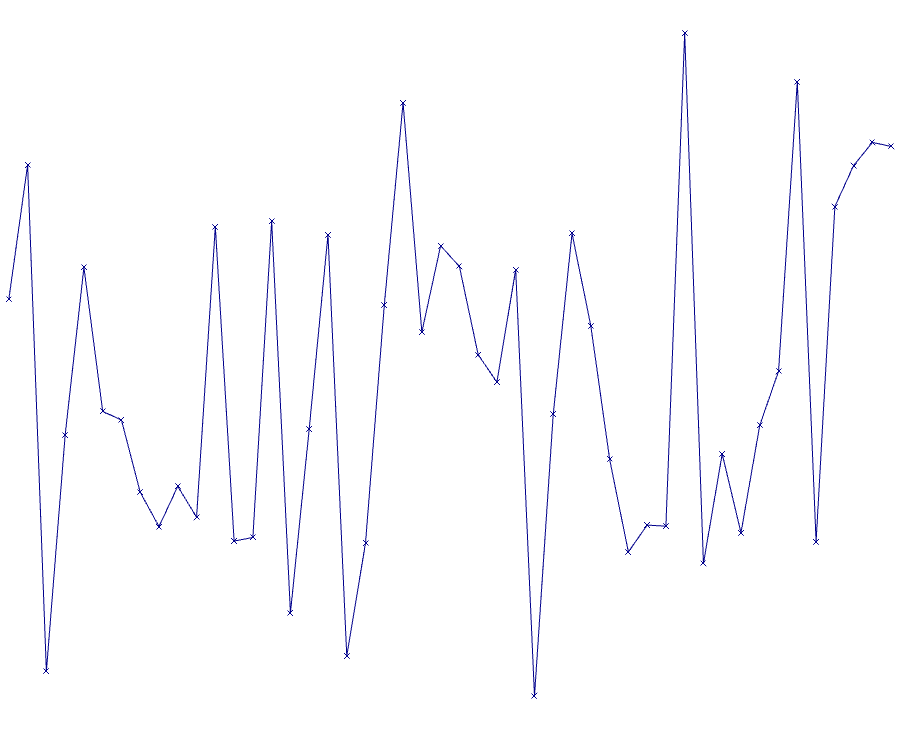

# Introdução

O conjunto de dados usado foi escolhido arbitrariamente e é composto por
uma tabela que contêm informações sobre os pontos em relevo que
descrevem os caractere em Braille. O código usa uma rede neural MLP com
uma camada de entrada e uma camada de saída para prever qual caractere
em Braille está sendo exibido.

MLP (multilayer perceptron) é uma rede neural artificial usada em
aprendizado supervisionado para classificação e regressão. Nessa
atividade foi usado o modulo Keras da biblioteca TensorFlow para
implementar o modelo em Python.

# Dados

O conjunto de dados utilizado neste estudo foi criado manualmente e
formatado como um arquivo CSV. Ele contém informações sobre os pontos
elevados que representam cada caractere Braille. Esse conjunto de dados
consiste em 48 linhas e 7 colunas, com cada linha representando um
caractere Braille exclusivo. A primeira coluna é para visualização,
enquanto as colunas restantes codificam a presença ou ausência de pontos
em um caractere Braille. As células são preenchidas com 0s ou 1s,
indicando se um ponto está ausente ou presente, respectivamente.

No sistema braille, os pontos 1, 2 e 3 formam a coluna da esquerda e os
pontos 4, 5 e 6 formam a coluna da direita, de cima para baixo. Para
fins deste estudo, as primeiras letras receberam intencionalmente a
mesma disposição de pontos que os números, criando um desafio de
classificação.

## Visualização dos dados

Visualizar o conjunto de dados antes de treinar o modelo pode fornecer
uma compreensão perspicaz das relações entre as variáveis.

<figure>

<figcaption aria-hidden="true">Gráfico de data-set braille</figcaption>
</figure>

### Kernel de uma camada

Em uma rede neural, o "kernel" de uma camada se refere aos pesos das
conexões entre essa camada e a camada anterior. Em outras palavras, são
os valores que são multiplicados pelas entradas para produzir a saída
antes da aplicação da função de ativação.

<figure>

<figcaption aria-hidden="true">Gráfico de kernel de saída</figcaption>
</figure>

<figure>

<figcaption aria-hidden="true">Gráfico de kernel de saída</figcaption>
</figure>

### Viés de uma camada

O "bias" em redes neurais refere-se a um valor adicional que é usado na
computação da saída de um neurônio, juntamente com a soma ponderada das
entradas. A adição de um valor de bias permite que o neurônio produza
saídas que melhor correspondam aos dados de treinamento, mesmo quando
todas as entradas são zero.

<figure>

<figcaption aria-hidden="true">Gráfico de bias de saida</figcaption>
</figure>

<figure>

<figcaption aria-hidden="true">Gráfico de bias de saida</figcaption>
</figure>

# Metodologia

## Rede neural

O modelo MLP empregado para esta pesquisa consiste em duas camadas. A
camada de entrada é composta por 6 neurônios, correspondendo ao número
de pontos elevados representados no conjunto de dados. Por outro lado, a
camada de saída tem 48 neurônios para corresponder ao número total de
caracteres Braille únicos nos dados de treinamento. As camadas utilizam
funções de ativação sigmoide e softmax, respectivamente.

## Treinamento

O modelo MLP foi treinado no conjunto de dados supracitado. Para isso,
foi utilizado o algoritmo de otimização Adam, com taxa de aprendizado de
0,01. A função categórica de perda de entropia cruzada foi escolhida
para guiar o processo de treinamento.

<figure>

<figcaption aria-hidden="true">Gráfico de treinamento</figcaption>
</figure>

# Resultados

O modelo alcançou uma precisão de treinamento de 77% e um valor de perda
de 1.26 após a conclusão das 300 épocas de treinamento.

Para comprara o resultado do modelo MLP foi feito uma árvore de decisão
usado a biblioteca scikit-learn treinando com mesmos dados chegou numa
acurácia de 54% e sua estrutura ficou assim
